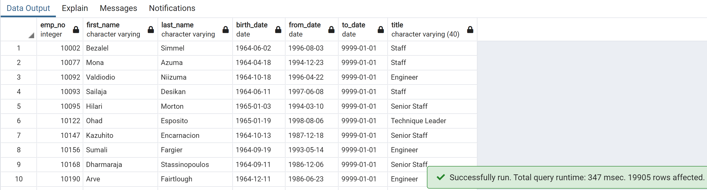
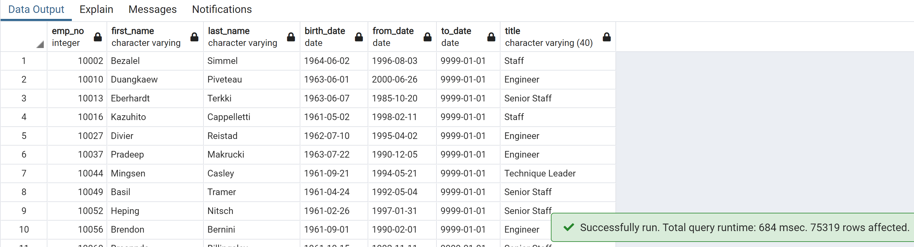

# Pewlett-Hackard-Analysis

## Overview:
This analysis was done on an employee data base to help identify how many employees would be retiring soon, and how many would be eligible to participate in a mentorship program.

## Results:
•	There are 72,458 retiring employees
•	The majority of retiring employees are in senior positions, with 25,916 Senior Engineers and 24,926 Senior Staff
•	There are 1,549 employees eligible for mentorship
•	The number of retirees vastly outnumbers the number of those eligible for mentorship

## Summary:
There are 72,458 retiring employees retiring and only 1,549 eligible for mentorship, leaving a large gap. In order to bridge this gap, you could potentially expand the mentorship group by a few years.
Expanding it by one year increased mentorship eligible employees to 19,905

Expanding it to a 5 year period increases it to 75,319

